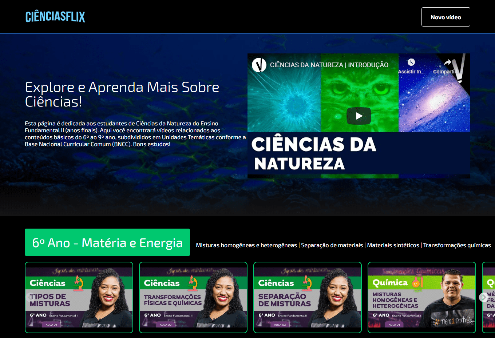

# Ciênciasflix

[https://cienciasflix.vercel.app/](https://cienciasflix.vercel.app/)

## About

This page is the result of a five-day ReactJS boot camp I participated in last week, promoted by Alura Cursos Online. It still has extra challenges to implement, but I am satisfied with what I was able to accomplish during that period. It was a good opportunity to get to know a little more about the front-end world. This project called Ciênciasflix (ciência means science in Portuguese) is a collaborative repository of video classes targeting middle school Brazilian students with free YouTube content. The content is curated by other science teachers and organized according to the national science curriculum.

## How to test this project in development mode

Got to the project directory and install its dependencies.

`npm install`

Run the app.

`npm start`

Open [http://localhost:3000](http://localhost:3000) to view it in the browser.
